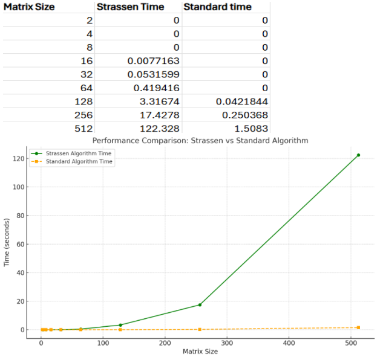
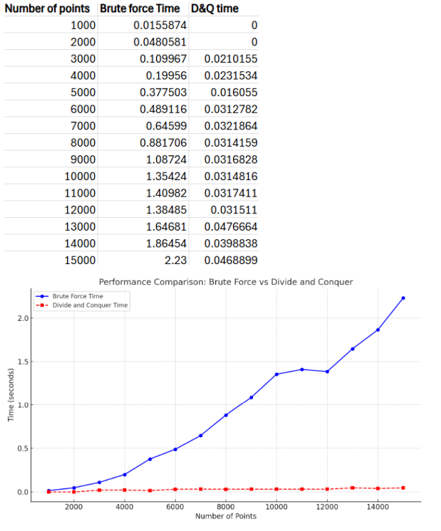

# 📊 Analysis Report: Implementing Divide and Conquer Algorithms

## 🗂️ Table of Contents

- [Introduction](#-introduction)
- [Implementation](#-implementation)
  - [Strassen's Matrix Multiplication](#part-1-strassens-matrix-multiplication)
  - [Closest Pair of Points](#part-2-closest-pair-of-points)
- [Performance Analysis](#-performance-analysis)
  - [Strassen vs. Standard](#strassens-matrix-multiplication-vs-standard-multiplication)
  - [Divide and Conquer vs. Brute Force](#divide-and-conquer-vs-brute-force-for-closest-pair)
- [Conclusion](#-conclusion)

## 📌 Introduction

This report covers the implementation and analysis of two algorithms leveraging the **divide-and-conquer** paradigm:

1. **Strassen's Matrix Multiplication**: A method for multiplying two `n × n` matrices more efficiently than the conventional approach.
2. **Closest Pair of Points**: An algorithm to find the closest pair of points in a 2D plane based on their Euclidean distance.

The divide-and-conquer strategy breaks problems into smaller subproblems, solves each recursively, and combines their results, often reducing time complexity significantly.

---

## 🔧 Implementation

### Part 1: Strassen's Matrix Multiplication

- **Overview**:  
  Strassen's algorithm reduces the number of multiplications by decomposing the problem into **seven subproblems** instead of eight, as in the naive approach.

- **Key Steps**:
  - Matrix sizes range from 2¹ to 2⁹.
  - Two random square matrices `a` and `b` are generated using the `genmat()` function.
  - The standard multiplication is done using the `mul()` function (O(n³)), and time is measured.
  - Strassen’s method is executed using the `strassen()` function, reducing time complexity to O(n^log7).
  - Time taken for both methods is recorded for comparison.

- **Challenges**:
  - Padding matrices to the next power of 2.
  - Debugging recursive calls and ensuring matrix indexing consistency.

---

### Part 2: Closest Pair of Points

- **Overview**:  
  The task is to find the closest pair of points in a 2D plane using Euclidean distance. The divide-and-conquer approach achieves **O(n log n)** complexity.

- **Key Steps**:
  - Input sizes range from 1,000 to 15,000 points.
  - Points are randomly generated using `genpoint()`.
  - A brute force method computes the distance between all point pairs (O(n²)) and records time.
  - The divide-and-conquer method recursively divides the space and finds the closest pair.
  - The minimum distance and the closest points are printed for both approaches, along with execution times.

- **Challenges**:
  - Efficient sorting and merging of points by `x` and `y` coordinates.
  - Handling edge cases (duplicates, collinear points).
  - Managing potential stack overflow due to deep recursion.

---

## 📈 Performance Analysis

### Strassen's Matrix Multiplication vs. Standard Multiplication

- **Observations**:
  - Although the theoretical complexity of Strassen’s method is **O(n^2.81)**, it performed **slower** in practice.
  - Overhead due to frequent vector creation, recursive function calls (`add()`, `sub()`, `strassen()`), and data copying likely caused the slowdown.

- **Graph**: A comparison graph was plotted to visualize the execution time differences between the two methods.

### Divide and Conquer vs. Brute Force for Closest Pair

- **Observations**:
  - As expected, the divide-and-conquer approach consistently outperformed brute force for larger datasets.
  - Execution time increased linearly compared to the quadratic time of brute force.

- **Graph**: A graph was plotted comparing execution time across increasing input sizes.

## ✅ Conclusion

### Insights

- **Strassen’s Algorithm**:
  - Theoretically efficient, but practically slower due to recursive overhead and memory management.
  
- **Closest Pair Algorithm**:
  - Achieved expected performance improvements using divide and conquer.
  - Risk of stack overflow due to deep recursion exists.

### Potential Optimizations

- **Strassen’s Algorithm**:
  - Use standard multiplication for smaller matrices to reduce overhead.
  - Optimize or cache vector operations to minimize recursive cost.

- **Closest Pair Algorithm**:
  - Leverage **parallel processing** for recursive steps to enhance performance.

---

